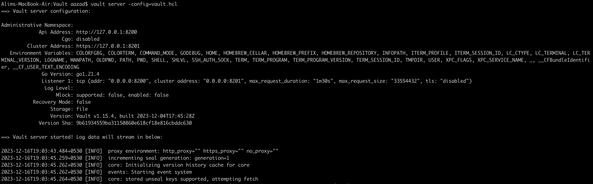
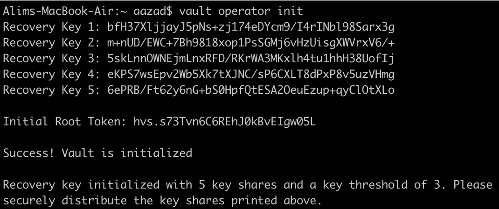

# vault-akv-auto-unseal

Local vault setup auto unseal using Azure Key Vault

# Steps

- Configure resource group, keyvault service and service principal with permissions to access key vault. Also generate the vault config file in HCL language

    ```terraform up -auto-approve```

- Start vault on local machine 

    ```vault server -config=vault.hcl```



- Set ```VAULT_ADDR``` environment variable

    ```export VAULT_ADDR="http://127.0.0.1:8200"``` or ```$env:VAULT_ADDR="http://127.0.0.1:8200"```
  
- Check vault seal status

    ```vault status```


- Run below command and it should show only recovery codes with root token.

    ```vault operator init```



- Destroy the resources

    ```terraform destroy -auto-approve```