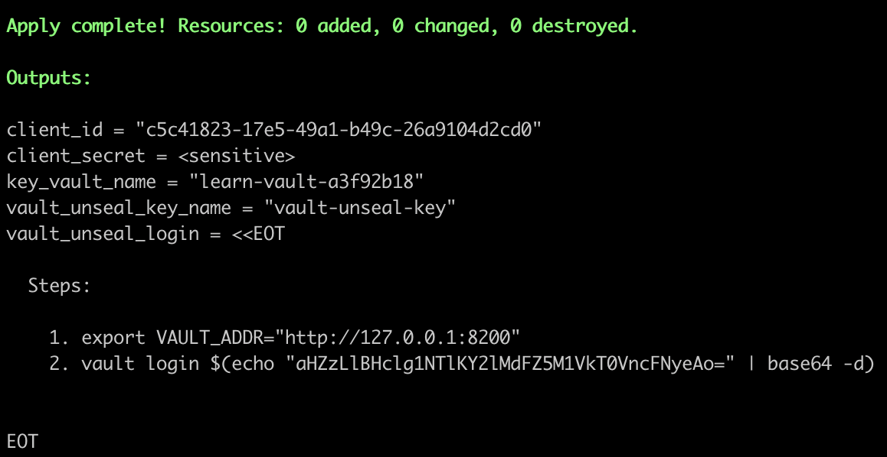
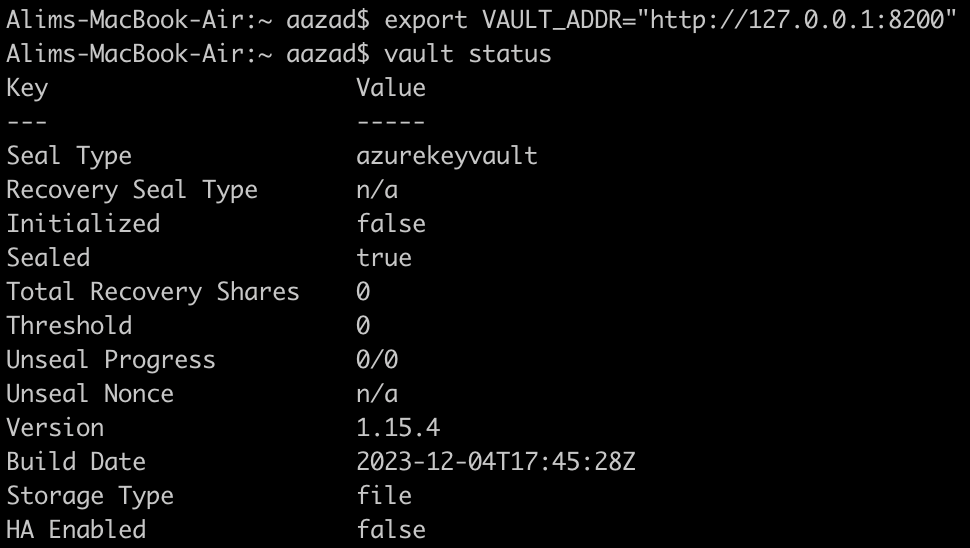
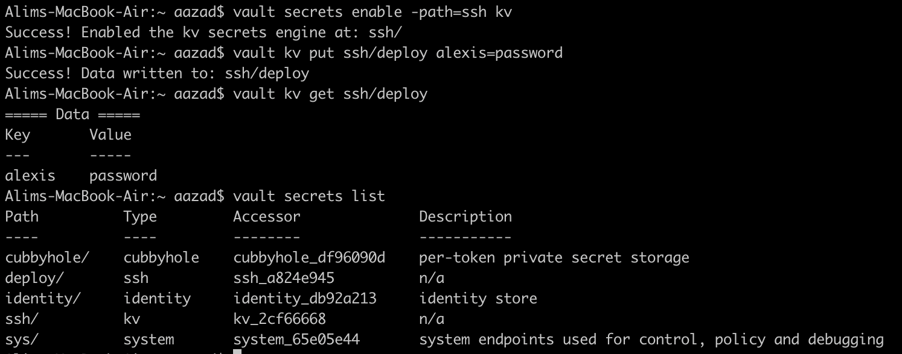

# vault-akv-auto-unseal

Local vault setup auto unseal using Azure Key Vault

# Steps

- Configure resource group, keyvault service and service principal with permissions to access key vault. Also generate the vault config file in HCL language with corresponding service principal secrets and key vault details. Unseal the vault with Azure Key Vault running as background process and provide steps to login.

    ```terraform up -auto-approve```



- Set ```VAULT_ADDR``` environment variable

    ```export VAULT_ADDR="http://127.0.0.1:8200"``` or ```$env:VAULT_ADDR="http://127.0.0.1:8200"```
  
- Check vault seal status

    ```vault status```



- Login with the root token command provided in output. Perform vault commands and verify.

    ```vault login $(echo "${data.local_file.vault_token.content_base64}" | base64 -d)```



- Destroy all the resources with storage and created files.

    ```terraform destroy -auto-approve```
